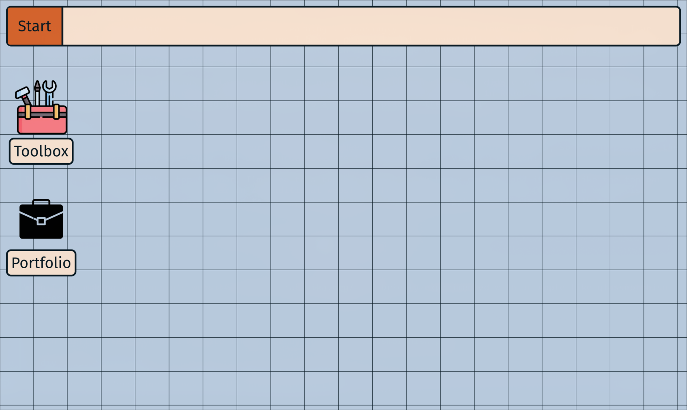
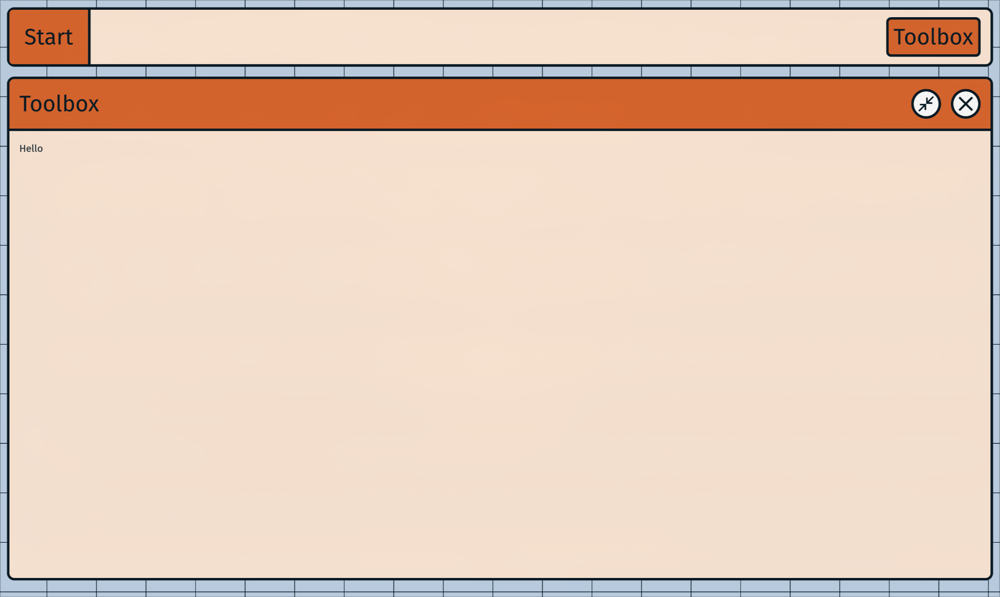
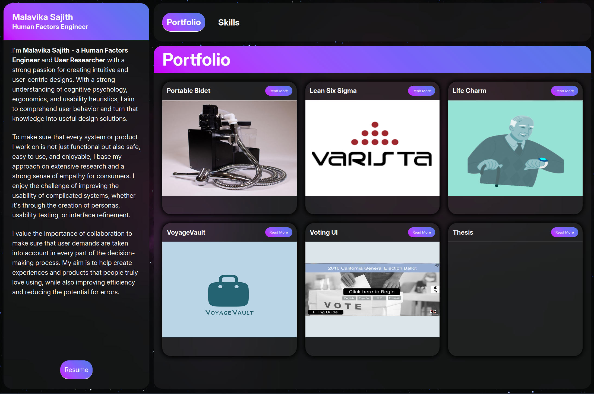

# Introduction
Over the past few weeks, I've been working on revamping my portfolio site. About time, too, as for the past several years I'd been using a React/ThreeJS portfolio that I built following a [tutorial](https://www.youtube.com/watch?v=0fYi8SGA20k).

These days, I understand a whole lot more about all the things I didn't know I didn't know - especially when it comes to web development. My first task as a renewed Websmith was to rebuild my [namesake site](https://www.adithyajith.com/) from the ground up.

I'll be writing up my progress as I go along, potentially turning this into a series if I rescope or add features down the line. My goal is to demonstrate the thought processes, struggles, and feelings that go into a full-stack project like this.

# The Planning Phase
I had no idea what I wanted my portfolio to look like. Most of the web portfolios I've seen have been pretty cut and dry. Simple, static sites with a few pages of information and content. I spent a lot of time looking at various portfolio sites, and ultimately I decided I wanted something more representative of my personality. Thus, I went in with some requirements:
- Made in NextJS and Tailwind
- Full mobile compatibility
- Interactive
- Animated
- Fun and interesting

## Why NextJS?
For a long time, the concepts of server vs client rendering seemed beyond my ken. As I grew to learn more about the JavaScript ecosystem and how front-end framework tools actually work, I finally grew to understand how nice it is to have tools like Vite and NextJS.

Prior to this portfolio, I mainly stuck to Vite and React for my web projects. But with NextJS's promise of easy SEO and performance potential, I wanted to give it a try. Plus, Vercel's hosting is a really easy way to share the progress of my website with others for feedback.

# First Iteration
While I was searching for inspiration and doing deep-dives on trending design philosophies, I found a great [Medium article](https://medium.com/@sepidy/how-can-i-design-in-the-neo-brutalism-style-d85c458042de) on neobrutalism by Sepideh Yazdi. And so, my initial pass at a portfolio design was a fun exploration of a new-yet-retro aesthetic style.

  

  

    An early neobrutalist version of my portfolio.
  

I got mixed reviews from this design, with some appreciating the bright colors and thick borders whereas others found it a little too childish and gimmicky for a professional portfolio site. Ultimately, I ended up scrapping the idea to build something a little more modern. Or should I say something a little _less retro_?

# Riffing on Operating Systems
With my recent explorations of Linux, I've been learning increasingly more about the lower levels of computing. I've always been fascinated by operating systems and I have a personal goal to eventually build one from scratch. Drawing inspiration from that desire, I decided to experiment with my knowledge of web technologies to try and simulate the _user experience_ of an operating system while still being functional as a personal portfolio.

I used the neobrutalist style as a starting point for my website (although clearly I didn't stick with it). With a general design language in mind, I set to work actually building out the interface in React. Since the general theme was an operating system, I started in what seemed to a sensible place - the taskbar.

# Taskbar

A taskbar is the central hub of an Operating System's UI. It's what provides the user with the tools they need to access all of the other features of the OS. A portfolio website doesn't exactly have a lot of features, so for my purposes the taskbar would be mostly eye-candy. But don't underestimate the importance of visual cohesion!

Initially, I started with a top taskbar. I'm used to a top bar layout on my Linux config, and it felt like the top bar would be more analogous to a navigation bar on a traditional website. The only things I needed the taskbar to accomplish really were to serve as an introduction to the portfolio, and to show which "applications" were currently open.

  

  

    A prior rendition of adiOS.
  

# Applications

In this version, I also added an application system. Basically, the application icons are buttons that launch a "window." I accomplished this in React with a stateful component that keeps track of all currently open applications in an array. When the array changes - i.e. an application is opened, closed, or otherwise changed in some way - the component is re-rendered.

I made the applications themselves draggable and animated the app in general using [GSAP](https://gsap.com/) - a pretty robust web animation system. Their documentation is really solid and everything I needed to know about integrating GSAP in a React application was boiled down to a single hook: [useGSAP()](https://gsap.com/resources/React/). 

As I was developing this application system, I quickly grew tired of drilling props back and forth between various layers of the website. This seemed like the perfect use case for React's [Context API](https://react.dev/learn/passing-data-deeply-with-context). I used the docs to whip up an Application Context component, and suddenly any component that needed access to the current application information simply needed to be wrapped with a Provider.

This made it easy to extend the functionality and interactivity of the application system to other parts of the website like the taskbar. Rather than the array of apps needing to be passed up from the WindowManager component and back down into the Taskbar component, the Taskbar component could instead get the current Application Context item and subscribe to changes directly (i.e. the Taskbar could now list which apps were open and toggle focus when those list items were clicked).

  

  

    A maximized application.
  

In earlier renditions of adiOS, I also had added the ability to maximize application windows. This was just a quick CSS toggle from auto width/height to 100%. I ended up scrapping this as it made the applications feel less consistent when resizing and changing their layouts. The application sizes are instead manual until they exceed the viewport dimensions.

# Redesigning _Everything_

Great, so everything's coming together! The application mimics the general feel of an operating system. There was just one problem: I kind of hated the way it looked. Time for a makeover.

So, neobrutalism didn't work out. What next? When I was making my [cousin's website](https://malavika.org/), I briefly experimented with an Apple-like glassmorphism effect. The blurs and super round corners definitely have their appeal and I think Apple in general knocks it out of the park with their design choices.

  

  

    An earlier iteration of a website I made for my cousin.
  

However, I'm trying not to be _too_ derivative here. I'm gonna want to mix things up somehow. As someone who was practically raised by the Internet, I have a lot of nostalgia for the Y2K aesthetic. It's cropped back up in a ton of different ways recently (e.g. vaporware, outrun, etc.) and I wanted to try and evoke that mid-2000s feeling of a wilder Internet ecosystem.

