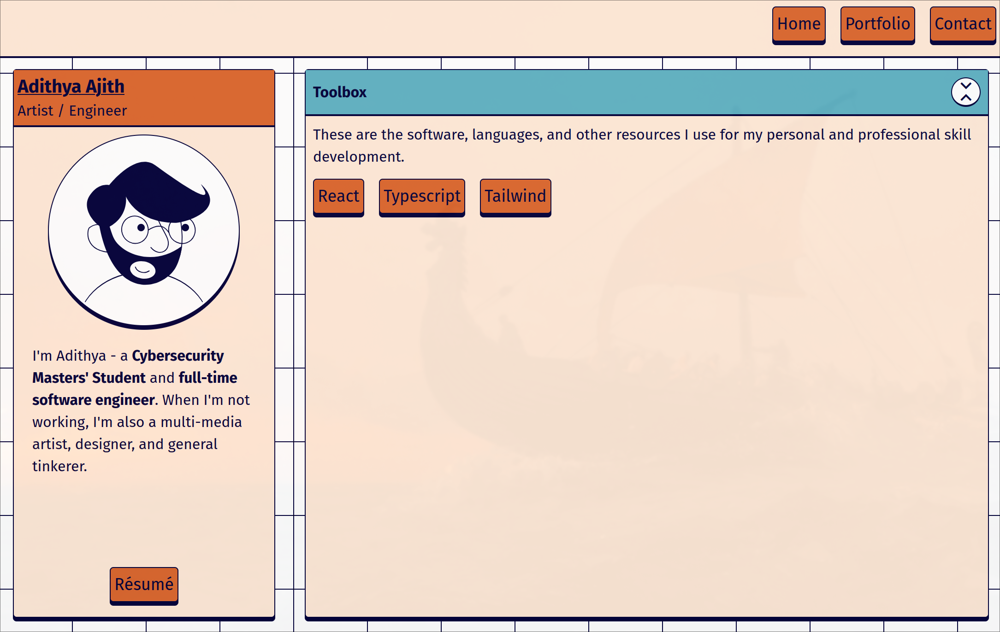

# Introduction
Over the past few weeks, I've been working on revamping my portfolio site. About time, too. For several years I've been using a React/ThreeJS portfolio that I built following a [tutorial](https://www.youtube.com/watch?v=0fYi8SGA20k).

These days, I understand a whole lot more about all the things I didn't know I didn't know - especially when it comes to web development. My first task as a renewed Websmith was to rebuild my namesake website from the ground up.

I'll be writing up my progress as I go along, potentially turning this into a series if I scope larger. My goal is to demonstrate the thought processes, struggles, and feelings that go into a full-stack project like this.

# The Planning Phase
I had no idea what I wanted my portfolio to look like. Most of the web portfolios I've seen have been pretty cut and dry. Simple, static sites with a few pages of information and content. I spent a lot of time looking at various portfolio sites, and ultimately I decided I wanted something more representative of my personality. Thus, I went in with some requirements:
- Made in NextJS and Tailwind
- Full mobile compatibility
- Interactive
- Animated
- Fun and interesting

## Why NextJS?
For a long time, the concepts of server vs client rendering seemed beyond my ken. As I grew to learn more about the JavaScript ecosystem and how front-end framework tools actually work, I finally grew to understand how nice it is to have tools like Vite and NextJS.

Prior to this portfolio, I mainly stuck to Vite and React for my web projects. But with NextJS's promise of easy SEO and performance potential, I wanted to give it a try. Plus, Vercel's hosting is a really easy way to share the progress of my website with others for feedback.

# First Iteration
My initial pass at a portfolio design was a fun exploration of neobrutalism.

