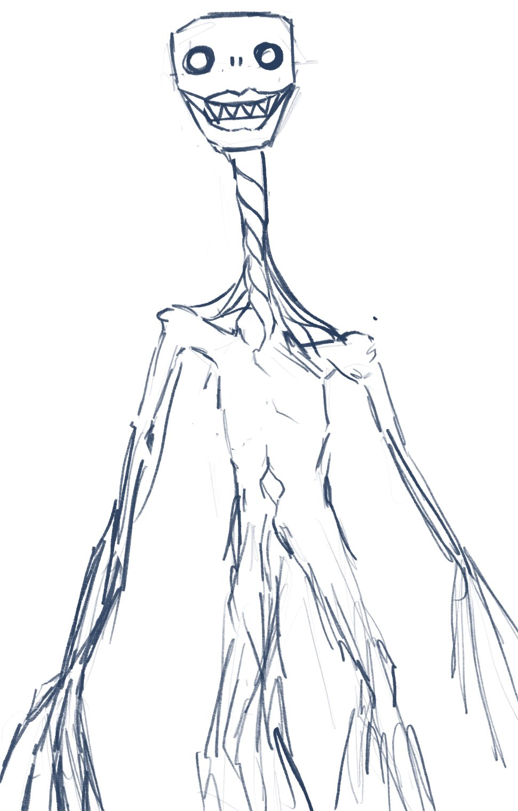
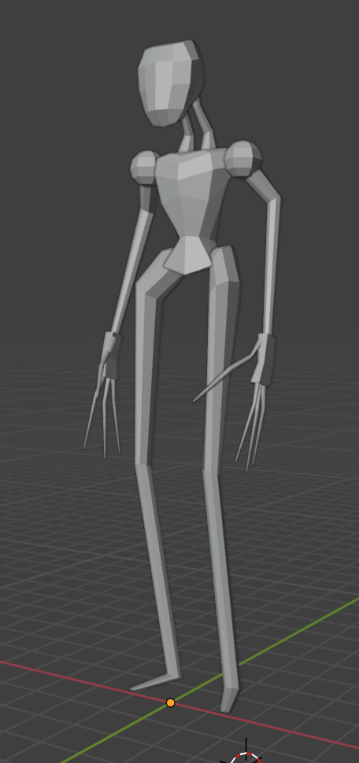
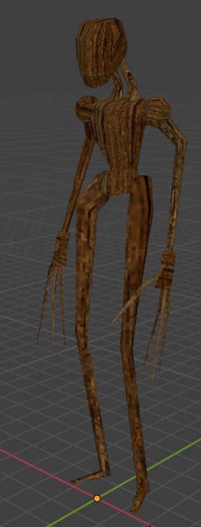
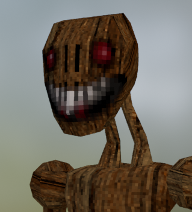
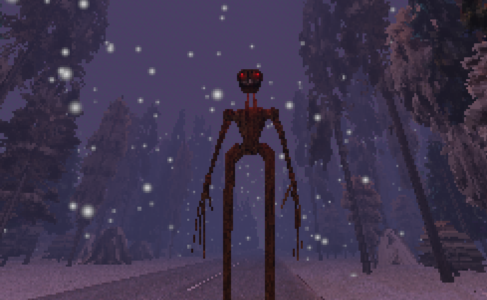
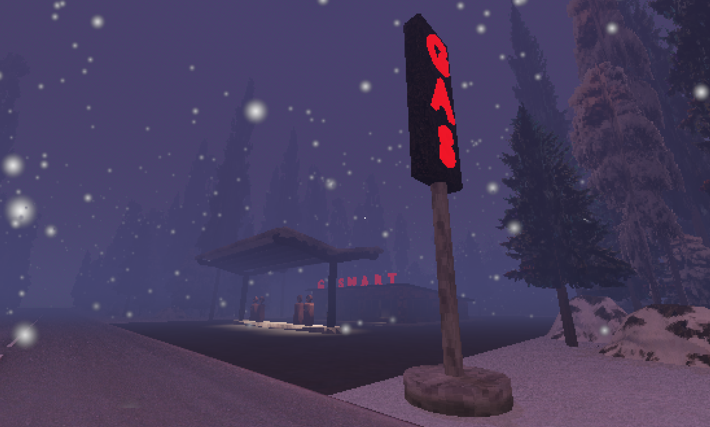
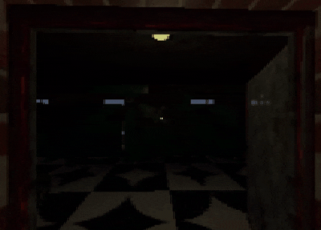
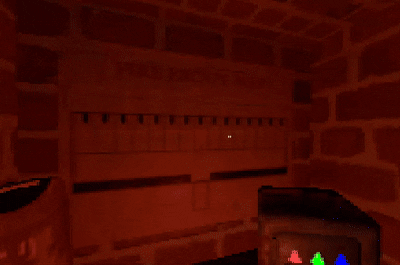
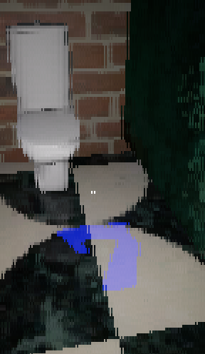

Game development is something I've always been passionate about. Unfortunately, making a game is a pretty massive undertaking, and one that's really easy to overscope. Thus, a lot of the solo game projects I've worked on prior are locked away on scattered, dusty hard drives.

I could hardly call myself a game developer with one published game, so I decided to focus my attention on completing a single game. To help me stay on task, I joined a game jam! A new member of the Solodev community, I decided that the fourth Marathon jam would be perfect. The jam had a pretty relaxed ruleset: make as much progress as you can in one month. That's it. Any project, as big or as small you want. Just a monthlong jam dedicated to steady progress.
# Goals
I really only had one goal, and that was to finish. But obviously, there would have to be other restrictions if I wanted to be serious about completing a game on time.

A while ago, I had an idea for a short, first-person, narrative-horror experience. It was based on a dream I had, where I ran out of gas on the road and had to walk alone, at night, down a long stretch of road. The world felt empty, but the gaze of some incorporeal entity still seemed to linger on me. I wanted to capture _that_ feeling in a game.

I also knew I wanted to use Godot for this one. I've experimented with Unity before, but I think there's something great about the open source community and its projects.

So, these were my final goals:
- Finish a game loop
- Capture the feeling of that nightmare
- Use Godot
- Do it in one month
# Development
## Choosing an Art Style
Given the monthlong requirement,  I didn't want to spend a ton of time making art assets. I opted for a pixelated, retro 3D effect reminiscent of the PS1. I used a few free assets off of itch.io for a few models like the trees and cars as well as some textures that I downscaled as needed. The rest, I made in Blender.
## Paging Dr. Frankenstein
Maybe frontloading the creative labor isn't the best idea, but I find it hard to imagine a horror game without knowing what I'm running from. With a game set in the woods, my thoughts quickly turned to some sort of ent-like, bark-skinned creature. Long, spindly, branch-like appendages and a full set of smiling teeth. A creature tall and gangly that moved in unnatural ways.

  

  

    I spent a while sketching out ideas before I had one that I could act on.
  

  

  
  
  
  
  
  

  

    I got to work in Blender demaking the concept to fit the retro aesthetic.
  

## Setting the Scene
I wanted the game to have an ethereal, dreamlike feel. A snowy and abandoned road - emphasizing themes of isolation, exploiting that natural human fear of the unknown - fit perfectly.

I got some low poly foliage assets from itch.io, some descaled snow and road textures, and launched Godot. It would've been way too tedious to manually place trees and bushes around to create the illusion of a dense, remote forest. Luckily, thanks to the dedicated Godot community, extensions like [ProtonScatter](https://github.com/HungryProton/scatter) exist for exactly this purpose.

After messing around awhile with the new nodes introduced by the extension, I had a result I was pretty happy with. I made the generated mesh instance its own component and distributed it around to create the bounds of the map.

I then got to work creating particle effects for the snow. Godot has a lot of built-in tools for image generation that made this process really easy (especially when combined with community resources like [this tutorial](https://www.youtube.com/watch?v=n5RAGhxHo28) from DevPoodle).

  

  

To tie the scene together, I added and tuned a world environment, directional light, volumetric fog, and downscaled the resolution to emulate lower-fidelity systems. 

## Moving Around
Now that I had a world, I needed to be able to explore it. Godot's default character controller script worked well enough, but [this guide](https://www.youtube.com/watch?v=A3HLeyaBCq4) from LegionGames made the movement that much more satisfying. With some [footstep audio](https://www.youtube.com/watch?v=raAe58RBees), the game started feeling a lot more immersive.
## The Haunted Gas Station
It's a favorite trope of mine. So I made one in Blender. To hone in on the creepiness factor, I tried to stick to gritty, deteriorated textures, like [these] from itch.io's community asset library.

I mashed together "gas" and "mart" to create the extremely witty name for my gas station market, "GASMART." 

  

  

At least it's got the "smart" double entendre, I guess.
  

## Time for a Gameplay Loop
So far, most of the game is just a walking simulator. I wanted to have at least _one_ gameplay loop closed by the time the jam was over. I decided to implement it in the GASMART bathroom. I modeled an interior, some toilets, stalls, sinks, counters, and a closet.

I put a small 3-digit combination safe with the key to the gas station inside, and decided the player would have to figure out the combination with a special flashlight that illuminates graffiti in the stalls. The catch? Our Hollowed friend will now be patrolling the bathroom to capture unwary players.

## It's Alive!
Rigging and animating the Hollowed was pretty similar to normal humanoid rigs with Rigify. 

  

  

My animations are still a little stiff, but I think that works to my advantage with this character.
  

With the basic walk cycle and a game over animation now complete, I added a bone-attached collider to check if the Hollowed was close enough to trigger a game over.

## Solving the Puzzle
To create the actual combination, I generated three random integers between 0 and 9 whenever the bathroom scene is loaded. I placed spawn locations for the combination numbers using Label3D nodes and made three of them show the random integers.

To make it a little easier, I color-coded the numbers by their position in the combination. Plus, you only really need two of the numbers to unlock the safe.

  
  

  

    The information is only visible when the flashlight is on.
  

## The Win Condition
At this point, I was three weeks into the game jam and struggling to find time to work on Treeline. I had a week to tie everything together, so I tried to add some polish. I finished cutscenes, made a menu, and added an end screen if the player brings the fuel can back to the car.

With that, the jam ended. I updated my submission and am now waiting for ratings to come in.
# Retrospection
I really enjoyed this game jam. I felt like the monthlong timeframe was the perfect amount of pressure for me to stick with the project and work on it actively. Although I didn't get everything that I wanted done, I'm proud of what I was able to accomplish within the limited confines of a game jam.

I think I'll continue working on Treeline. Now that the time pressure isn't a factor, I can take a step back and refactor my project. With Godot 4.4's latest release happening mid-jam, I haven't had a chance to try it out yet. I'll probably end up migrating to it soon.

If you'd like to play the game yourself, the version from the jam is downloadable for Windows on my [itch.io page](https://adharmic.itch.io/treeline).

# Next Steps
Once I've finished refactoring the existing mechanics, I want to continue with the idea I have for the interior of GASMART with procedurally generated mazes. I want to expand the story of Treeline a little more to match the original idea I had with additional scenes and encounters. I also want to polish up the UI and add settings.
